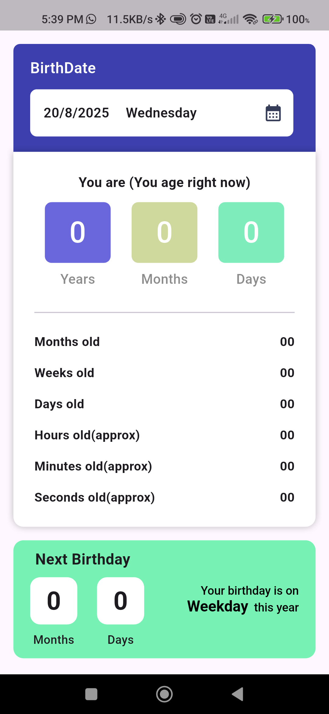

# Age Calculator (Flutter)

A simple and accurate **Age Calculator** built with **Flutter**.  
This app calculates a user’s exact age and next birthday details based on the selected date of birth.

## ✨ Features

- Calculate exact age in:
    - Years
    - Months
    - Days
- Calculate total age details:
    - Total months
    - Total weeks
    - Total days
    - Total hours
    - Total minutes
    - Total seconds
- Next birthday details:
    - Months remaining
    - Days remaining
    - Weekday of next birthday
- Clean and user-friendly UI
- Accurate date calculations (handles month-end edge cases)

## Screenshoots

## Getting Started

- [Lab: Write your first Flutter app](https://docs.flutter.dev/get-started/codelab)
- [Cookbook: Useful Flutter samples](https://docs.flutter.dev/cookbook)

For help getting started with Flutter development, view the
[online documentation](https://docs.flutter.dev/), which offers tutorials,
samples, guidance on mobile development, and a full API reference.